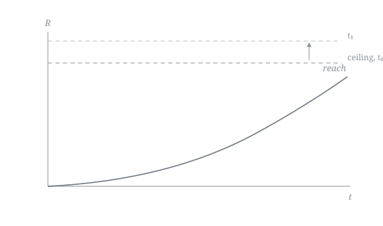
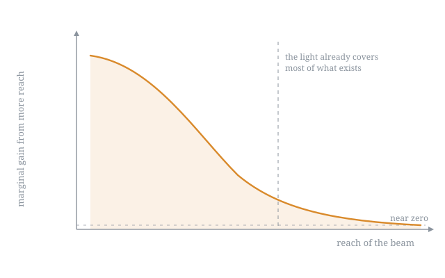
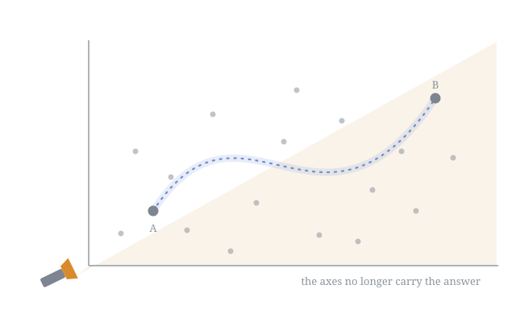

# Origin

Data centers are becoming an extraction industry, if they are not one already. Not the old
line about data being valuable — the literal thing. Land, power, water, cooling, and the same
mix of public and private money that once went looking for oil, now pointed at computation.

That part I am confident about. What I am not sure about is what follows from it: whether
access to that much computation is what actually changes the terms for whoever holds it.

But the direction is not in question. A context window that only grows is not a forecast. It
is the guaranteed output of an industry with that much money moving one way. So before having
opinions about whether any of this is good, I would rather start with the plain question:
what happens to a context that only grows?

## A flashlight that is switched off

There is a flashlight on the table. Switched off. It stands for everything that will
eventually light up the digital world — a model, a tool, a technology — but for now it is dead
weight, with no function, because there is not yet enough context to power it.

It only comes on once something generates enough data to run it. And when it does, it starts
weak.

## A weak beam, a short throw

The first models were simple. Little memory, little reach, few tokens processed at once. The
beam comes on, but it only covers what is close: a handful of points, a thin slice of what
exists.

It did not stay that way.

## What widened the beam

A million tokens at once. Deep thinking. Search. All of it, underneath, built for the same
reason: to make the model see further. Not magic — brute force applied to the reach of the
light. And brute force is exactly what the extraction industry above is there to sell.

The effect shows up as a curve. The more time passes, the further the beam throws — you could
plot the whole thing as a regression: context climbing on the time axis, one technology at a
time.

*Figure 1. Reach over time. There is a theoretical ceiling — the bytes, the floor of everything
that can be represented — but it moves up every time context improves.*

## The cone widens until it covers the field

At some point the cone grows so wide it stops behaving like a beam. It stops selecting. And
the strange part: nobody knows exactly where it ends, because the ceiling above keeps being
pushed further out.

This is where the question changes shape. While the light still had a visible edge, the game
was clear: throw further. But once it already covers almost everything that exists in the
digital world, that marginal gain collapses. A stronger beam stops showing you more.

*Figure 2. The marginal gain from more reach, against reach itself. Past the dashed line, a
brighter beam buys almost nothing.*

## A shortcut between points that never touch

And it is inside that already-saturated light that things get interesting. Notice that time
stops mattering here — you stop watching the trajectory and start looking at what is already
inside the brightness.

Two points, far apart. Isolated, they read as noise: two arbitrary bytes, no obvious relation,
each on its own side, with nothing that visibly ties them together.

But a shortcut exists between them. A wormhole inside the context itself: a curve that follows
no linear logic, that folds the space and connects A to B even when nothing in between seems
to justify the link. Alone, each byte says little. Combined — in any order, flipped,
reversed — they converge on the same place.

That is a subcontext: a dimension that only exists in the combination, never in the isolated
point. It is not about throwing further. It is about finding the folds inside what is already
lit.

*Figure 3. Inside the lit field. The seam between A and B follows neither axis, and no amount
of additional reach would have produced it.*

## The RNA of context

If total context is the DNA — the whole chain, everything stored, static, waiting — the
subcontext is the RNA. The active reading that turns that raw file into meaning. The DNA holds
everything; the RNA decides, out of all of it, what becomes action now.

A model with near-infinite context and no second layer is just a giant, mute DNA. What will
separate an average model from an exceptional one will not be the reach of the beam anymore —
that will already be solved, or close to it. It will be the ability to find, inside the entire
lit field, the wormholes nobody had seen yet: the points that, combined with each other, in
near-infinite combinations, reveal a path the raw context alone would never hand over.

When that happens, the tools for that search need to already exist. Not for the next edge of
the light — that edge will keep existing, but it will matter less and less. The search that
will actually matter is for the seam between points that were always there, lit, isolated,
waiting for someone to see that, together, they form something else.

---

There is a reason this is a flashlight and not a candle. A candle only gets brighter. A
flashlight is aimed, and someone is holding it.

I did not start this to solve a model's context window. I started it because the same
discipline kept showing up everywhere I paid attention long enough to need it back later — a
partnership program, a technical query, a side project, a course I was studying. The figures
above describe a problem that is still coming for the tools. This repository describes a habit
that got there first: deciding, line by line, which points are worth connecting, and writing
down why.
