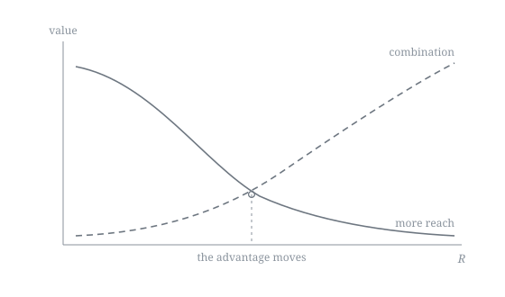
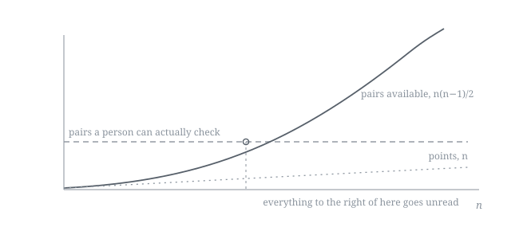

# Origin

Data centers are becoming an extraction industry, if they are not one already. Not the old
line about data being valuable. The literal thing: land, power, water, cooling, and the same
mix of public and private money that once went looking for oil, now pointed at computation.

That part I am confident about. What follows from it I am not, and the open question is
whether access to that much computation is what actually changes the terms for whoever holds
it.

The direction is not in question. A context window that only grows is not a forecast. It is
the guaranteed output of an industry with that much money moving one way. So before having
opinions about whether any of this is good, I would rather start with the plain question.
What happens to a context that only grows?

## A flashlight that is switched off

There is a flashlight on the table, switched off. It stands for everything that will
eventually light up the digital world: a model, a tool, a technology. For now it is dead
weight with no function, because there is not yet enough context to power it.

It comes on only once something generates enough data to run it. And when it does, it starts
weak.

## A weak beam, a short throw

The first models were simple. Little memory, little reach, few tokens processed at once. The
beam comes on, but it covers only what is close: a handful of points, a thin slice of what
exists.

It did not stay that way.

## What widened the beam

A million tokens at once. Deep thinking. Search. All of it built for the same reason, which is
to make the model see further. Not magic. Brute force applied to the reach of the light, and
brute force is exactly what the extraction industry above is there to sell.

The effect shows up as a curve. The more time passes, the further the beam throws. You could
plot the whole thing as a regression, with context climbing on the time axis, one technology
at a time.

*Figure 1. Reach against time, drawn as steps because that is how it arrives. There is a
theoretical ceiling: the bytes, the floor of everything that can be represented. It moves up
every time context improves, which is why it is drawn twice. The shape is the claim here, not
the scale.*

## The cone widens until it covers the field

At some point the cone grows so wide it stops behaving like a beam. It stops selecting. And
nobody knows exactly where it ends, because the ceiling above it keeps being pushed further
out.

This is where the question changes shape. While the light still had a visible edge, the game
was clear: throw further. Once it covers almost everything that exists in the digital world,
that marginal gain collapses. A stronger beam stops showing you more.

*Figure 2. As reach grows, what an additional unit of it buys falls, on the solid line. The
number of pairs available inside the lit field grows, on the dashed one. Where they cross, the
cheaper move stops being more light and starts being better connections. The next figure is
why the dashed line climbs. No measurement is claimed here.*

## A shortcut between points that never touch

It is inside that saturated light that things get interesting. Notice that time stops
mattering here. You stop watching the trajectory and start looking at what is already inside
the brightness.

Two points, far apart. Isolated, they read as noise: two arbitrary bytes, no obvious relation,
each on its own side, with nothing that visibly ties them together.

But a shortcut exists between them, a wormhole inside the context itself. A curve that follows
no linear logic, that folds the space and connects A to B even when nothing in between seems
to justify the link. Alone, each byte says little. Combined, in any order, flipped or
reversed, they converge on the same place.

That is a subcontext: a dimension that exists only in the combination, never in the isolated
point. It is not about throwing further. It is about finding the folds inside what is already
lit.

It helps to have one in hand, so here is a subcontext taken from this repository's own worked
case in [`WALKTHROUGH.md`](WALKTHROUGH.md).

Two lines sit in a raw log. The first says a rewritten contract clause came back accepted in
under an hour. The second says that on 4 February someone decided to push rather than keep
waiting. Alone, the first is a scheduling detail and the second is a diary entry. Neither is
worth keeping.

Put them together and they falsify the conclusion everyone had already drawn. A legal team
does not clear a rewritten clause in under an hour if that clause was what stood in the way.
The speed of the acceptance is evidence against the clause being the whole story, and what
actually moved the deal was a decision nobody had written down as a cause. That reading is in
neither line. It exists only in the pair, and it disappears the moment the two lines are filed
in separate places by someone who forgets they were ever related.

Which is why the method makes one demand that looks like bureaucracy and is not. A link that
crosses branches has to carry the reason for the link, written out next to it. The two files
will still be there in two years. The reason they were joined will not, unless someone wrote
it down. The comment on the link is the subcontext, stored.

## Why this cannot be brute forced

There is an arithmetic problem underneath all of this, and it is the reason the answer has to
be a method rather than a bigger machine.

Points inside the lit field arrive one at a time. The pairs between them do not. Ten points
make 45 pairs. A hundred points make 4,950. A thousand points make close to half a million.
The field grows by addition while the connections grow by multiplication.

*Figure 3. Available pairs against the count of points. The flat dashed line is not a claim
about machines. It is a claim about a person, whose capacity to read a connection and judge
whether it means anything stays roughly the same from one week to the next.*

That gap does not close by trying harder. It is the shape of the arithmetic, and it opens
almost immediately.

So one question is left, and it is not a technical one. Out of everything available, which
connections get looked at?

Answering by enumeration stops being possible within the first few dozen notes. Answering by
taste is how archives rot, because taste leaves no record and cannot be argued with later.
What remains is answering by rule: written down, revisable, with the reason attached.

## The RNA of context

If total context is the DNA, the whole chain, everything stored, static, waiting, then the
subcontext is the RNA: the active reading that turns that raw file into meaning. The DNA holds
everything. The RNA decides, out of all of it, what becomes action now.

A model with near-infinite context and no second layer is a giant, mute DNA. What separates an
average model from an exceptional one will not be the reach of the beam, because that will
already be solved or close to it. It will be the ability to find, inside the entire lit field,
the wormholes nobody had seen yet: the points that, combined with each other in near-infinite
combinations, reveal a path the raw context alone would never hand over.

When that happens, the tools for that search need to already exist. Not for the next edge of
the light. That edge will keep existing, but it matters less every year. The search that will
matter is for the seam between points that were always there, lit, isolated, waiting for
someone to see that together they form something else.

---

There is a reason this is a flashlight rather than a candle. A candle only gets brighter. A
flashlight is aimed, and someone is holding it.

I did not start this to solve a model's context window. I started it because the same
discipline kept showing up everywhere I paid attention long enough to need it back later: a
partnership program, a technical query, a side project, a course I was studying. The figures
above describe a problem that is still coming for the tools. This repository describes a habit
that got there first, which is deciding, line by line, which points are worth connecting, and
writing down why.
