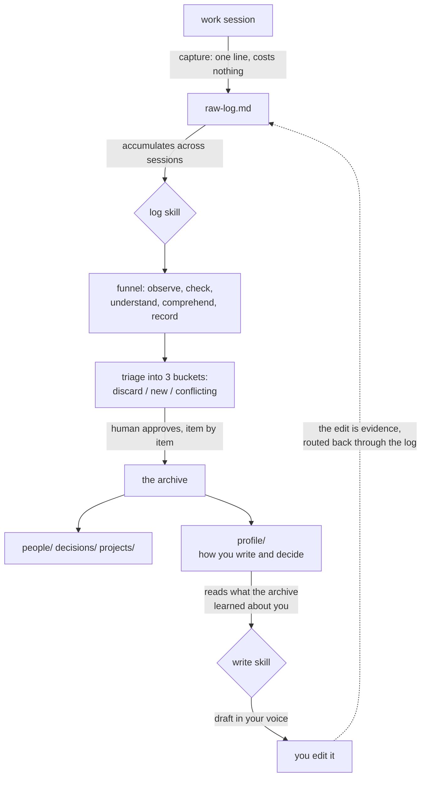

# Second Brain Method

A method for building a personal knowledge base that an AI agent can read, and that a
human stays accountable for.

It is a set of rules about three things: what earns a place in the archive, how a claim
carries its own evidence, and where the line sits between what a machine may decide and
what a person must. The tooling underneath is deliberately thin. Plain markdown files and an
agent that reads the rules before it writes anything, nothing else required to start.

> You do not need to know the tool. You need to know the reasoning.

## How it runs



Two skills, two directions. One puts information **into** the archive and learns how you
work while doing it. The other uses what the archive learned to write **as** you. The loop
closes through the log skill rather than writing back directly, so there is one account of
how you work, not two competing ones.

## The problem it solves

Three earlier attempts at organizing the same knowledge failed, and all three failed the
same way: they produced too many files, not too few. The archive held hundreds of notes
and still answered "not found" for something sitting one directory away.

The diagnosis was that it failed for lack of a route to the data, not for lack of the
data. Two commitments follow from that, and they run through everything else here:

1. **Little gets in, and what gets in has to survive time.**
2. **Reading is as much a design problem as writing.** A system that only teaches you to
   write produces a warehouse.

## Core rules

**The golden rule.** A piece of information becomes a file only if it will still be true
in six months, or if it explains why a decision was made. Everything else stays in the
session log and never becomes a note.

**The rationale outweighs the conclusion.** A file that records what was decided is
useful for a quarter. A file that records why it was decided is useful the next time you
have to decide.

**Titles are claims, not nouns.** `She decides by consensus, not by hierarchy` beats
`Her`. This is a reading decision rather than a stylistic one: when every title asserts
something, the generated index answers most questions before you open a file.

**Confidence attaches to the sentence, not to the file.** A note with ten claims does not
have a single confidence level, so each claim carries its own inline, along with the
sources behind it.

**Evidence only counts when it is independent.** Someone's account of a meeting and the
transcript of that meeting are one piece of evidence, not two. The operational test is a
different date and a different type of source. Without it, a reading of mine, observed
again three times, climbs to fact with a date and a source attached, and starts to look
like data.

**Deterministic work belongs to the machine, judgment belongs to the person.** Scripts
propose and never edit the archive. A single skill has write access to it. Approval is a
click rather than free text, because a gate that asks you to compose the authorization
becomes a rubber stamp.

**A rule below fifty percent measured adherence goes back on the table.** Not revoked
automatically, but reviewed with the count beside it, and either rewritten to match what
actually happens or dropped. Two rules have already gone that way. A maximum note size,
which was being followed 47 percent of the time, and a requirement that every link carry
a comment explaining it, which was being followed in none of the 315 links that existed
when it was measured. The rule that replaced the second one, requiring a comment only on
links that cross between branches, was last measured at 53 percent and stays for now, a
number that is expected to drift as the archive grows and has not been rechecked since.

## Repository layout

`AGENT.md` is the center. It is the only file an assistant has to read before it can start
working, and everything else here builds on top of it, not before it.

```
README.md            you are here

AGENT.md             <- start here. paste this into your assistant, that alone runs it
  |
  +-- skills/
  |     log/SKILL.md      the consolidation ritual, in full: modes, triage, closing report
  |     write/SKILL.md    writing in the archive owner's voice, calibrated by profile/
  |
  +-- METHOD.md      the reasoning behind every rule in AGENT.md, read only if you want why

examples/            synthetic notes from a fictional company, showing the format filled in
```

## Getting started

`AGENT.md` is enough on its own to make this executable rather than just a description.
Paste it into your assistant as a system prompt or project instructions, then:

1. Create four folders: `people/`, `decisions/`, `projects/`, `profile/`. Add more only once
   three or more things stop fitting the ones you have.
2. Create an empty `raw-log.md`.
3. Work normally. Whenever something worth keeping comes up, a fact, a decision, a reason,
   tell your assistant to capture it. Each entry costs one line.
4. When you want the archive to catch up, say something like "run the log." Your assistant
   reads `raw-log.md`, applies the funnel described in `AGENT.md`, and shows you a plan
   before writing anything.
5. Look at `examples/` for what a finished note looks like: a claim as a title, a source, a
   confidence level attached to the sentence that earned it.

If your assistant discovers skills automatically from a `skills/<name>/SKILL.md` layout,
drop the `skills/` folder in too. `log` turns the consolidation ritual into its own
invocable procedure instead of a paragraph inside `AGENT.md`, and `write` is a second one
this starter kit did not have before: drafting messages in the archive owner's own voice,
calibrated against whatever `profile/` has accumulated so far, and honest about writing
generically when it has not accumulated anything yet.

The reasoning behind every rule here is in `METHOD.md`. You do not need to read it to get
started, it is where "why this and not something simpler" gets answered.

## Limits

The method assumes an operator who stands behind the output. The machine holds the
structure and the person holds the accountability, because the person is the one in the
room on Monday and the one who pays for a wrong claim. Without that operator you get a
well organized archive that nobody is answerable for.

It was also built for one person's working knowledge. Nothing here has been tested as a
shared team archive, and several of the rules would probably break under multiple
writers.

## How this repository was written

The method is operated with an AI assistant, and so was this repository: drafted with
one, edited by me. That is the same arrangement the method describes, so leaving it out
would be strange. What I do not delegate is the judgment about what stays.

## Status

This is not the first attempt at this. An earlier, differently designed personal system ran
before it, and the section above describes what did not work about it. Nothing from that
system was migrated into this one, only the lessons about why it broke. This version was
built from scratch starting in August 2026, and has been running daily since.

The full method is in [`METHOD.md`](METHOD.md). `AGENT.md`, `skills/`, and `examples/` turn
it into something you can run today, on your own archive.

## License

CC BY 4.0. Use it, adapt it, credit it.
