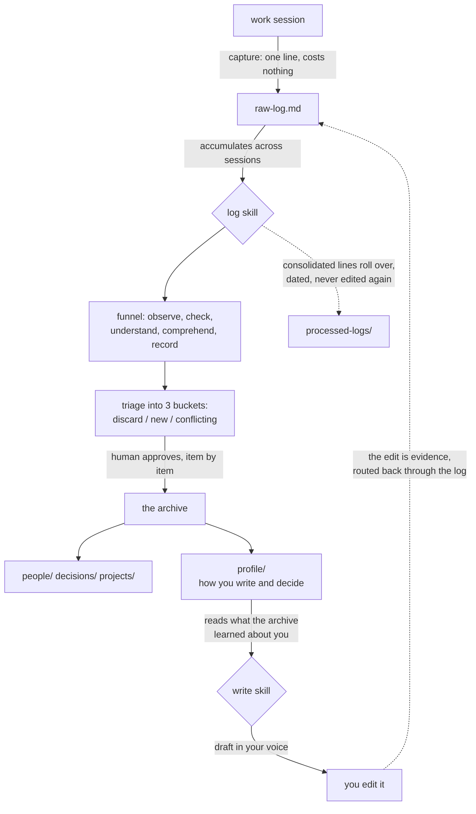

# SGM, a System for Governed Memory

A method for deciding what an AI assistant is allowed to remember about your work, and who
answers for it when what it remembered turns out to be wrong.

| if you want | open |
|---|---|
| **to see it work**, on one case, from a raw line to three connected notes | [`WALKTHROUGH.md`](WALKTHROUGH.md) |
| **to see it fail**, the nine claims this repository wrote in its first 43 hours that could not be backed, each with the commit that fixed it | [Part 2](WALKTHROUGH.md#part-2-the-same-method-applied-to-this-repository) |
| **to run it today**, with whatever assistant you already use | [`AGENT.md`](AGENT.md) |
| **to argue with the rules**, including the two that measurement revoked | [`METHOD.md`](METHOD.md) |

The rest of this page is the reasoning. The table above is the shortcut.

---

Give a machine five hundred dictionaries and it will speak the language. It still will not
know what is worth saying.

I built this to shorten the distance between what I decide, what gets recorded, and what I
can still defend six months from now. It does not make the machine smarter. It decides what
the machine is allowed to keep, and who answers for it.

Behind it is a position I hold and cannot prove: in an environment with AI, the advantage
moves to whoever holds the criteria rather than the repertoire, and criteria is forged round
by round. This repository is the instrument. It is not the proof.

## What this is

Context engineering for one person's working knowledge. Not a note taking app and not a
memory layer: those store and retrieve. This governs **admission**. What earns a place, how a
claim carries its own evidence, when a claim has to leave, and where the line sits between
what a machine may decide and what a person must.

Tools already exist that solve persistent memory and graph maintenance. This solves the part
that comes before either: deciding what deserves to be in there at all.

The tooling underneath is deliberately thin. Plain markdown files and an agent that reads the
rules before it writes anything.

> You do not need to know the tool. You need to know the reasoning.

## How it runs



**The log ritual is the method.** Everything else in this repository is vocabulary for
describing it. `skills/log/SKILL.md` is that ritual written out as a procedure, and
`skills/write/SKILL.md` is the return direction: it uses what the archive learned about you
to draft in your voice, then routes your edits back through the log rather than writing to
the archive itself, so there is one account of how you work instead of two competing ones.

The job of the log is not to summarize. It is to decide what deserves to survive.
**A log that records everything is as useless as one that records nothing.**

## The problem it solves

Three earlier attempts at organizing the same knowledge failed, and all three failed the
same way: they produced too many files, not too few. The archive held hundreds of notes and
still answered "not found" for something sitting one directory away.

The diagnosis was that it failed for lack of a route to the data, not for lack of the data.
Two commitments follow from that, and they run through everything else here:

1. **Little gets in, and what gets in has to survive time.**
2. **Reading is as much a design problem as writing.** A system that only teaches you to
   write produces a warehouse.

## Core rules

**The golden rule.** A piece of information becomes a file only if it will still be true in
six months, or if it explains why a decision was made. Everything else stays in the session
log and never becomes a note.

**The rationale outweighs the conclusion.** A file that records what was decided is useful
for a quarter. A file that records why it was decided is useful the next time you have to
decide.

**Argue the opposite before accepting a conclusion.** Every conclusion is stated against its
strongest counter case before it can be recorded. A model agrees too easily: hand it a
hypothesis and it hands the hypothesis back, better dressed. Forcing the antithesis makes it
return to the evidence instead of returning to you. A conclusion that does not survive gets
marked as a hypothesis, or dropped.

**Titles are claims, not nouns.** `She decides by consensus, not by hierarchy` beats `Her`.
This is a reading decision rather than a stylistic one: when every title asserts something,
the generated index answers most questions before you open a file.

**Confidence attaches to the sentence, not to the file.** A note with ten claims does not
have a single confidence level, so each claim carries its own inline, along with the sources
behind it.

**Evidence only counts when it is independent.** Someone's account of a meeting and the
transcript of that meeting are one piece of evidence, not two. The operational test is a
different date and a different type of source. Without it, a reading of mine, observed again
three times, climbs to fact with a date and a source attached, and starts to look like data.

**Deterministic work belongs to the machine, judgment belongs to the person.** Scripts
propose and never edit the archive. A single skill has write access to it. Approval is a
click rather than free text, because a gate that asks you to compose the authorization
becomes a rubber stamp.

**A rule below fifty percent measured adherence goes back on the table.** Not revoked
automatically, but reviewed with the count beside it, and either rewritten to match what
actually happens or dropped. Two rules have already gone that way. A maximum note size, which
was being followed 47 percent of the time, and a requirement that every link carry a comment
explaining it, which was being followed in none of the 315 links that existed when it was
measured. The rule that replaced the second one, requiring a comment only on links that cross
between branches, was last measured at 53 percent and stays for now, a number that is
expected to drift as the archive grows and has not been rechecked since.

## What enters, what stays, and what leaves

Most systems describe only the first of those, which is why they grow forever. This one has
three gates, and the third is what keeps it usable.

| state | gate |
|---|---|
| **enters** | the golden rule: still true in six months, or explains a decision |
| **stays** | the confidence ladder. A claim that never earns a second independent source stays a hypothesis, permanently, and that is not a defect |
| **leaves** | two doors: an ambiguity gets resolved, or a rule falls below fifty percent measured adherence |

And the principle that makes the third gate safe:

> **Leaving is a write, not a delete.** The wrong version is removed. The fact that it existed,
> and why it fell, stays in one line. Nothing leaves silently.

The exit runs through the same log ritual as the entry. Removing is a decision, and decisions
go through the gate. The funnel is not the front door, it is the door.

Section 1 of [`METHOD.md`](METHOD.md) has the full mechanics of all three gates.

## The human gate

Give a machine five hundred dictionaries and it will speak the language fluently. Fluency is
not judgment, and volume of knowledge is not a criterion. That is the whole argument for the
gate, and it is why approval is a click on a specific item rather than a sentence you compose.

The claim is testable, and this repository is where it got tested. In its first 43 hours,
**nine assertions were written into it that could not be backed, and all nine were caught and
corrected before anyone read them.** They are in the commit history with hashes, sorted into the
three ways this fails, in [`WALKTHROUGH.md`](WALKTHROUGH.md).

One of the nine is worth naming here: a false precision was introduced *while cleaning up the
wording of a table*. An edit made to improve the text created an unbacked claim. That is where
the errors actually come from. Not from the writing, from the revision, in the step where
nobody is looking.

## Repository layout

`AGENT.md` is the center. It is the only file an assistant has to read before it can start
working, and everything else here builds on top of it, not before it.

```
README.md            you are here

WALKTHROUGH.md       <- read this second. the method applied to a case,
                        and then applied to this repository

AGENT.md             <- start here to run it. paste this into your assistant,
  |                     that alone is enough
  |
  +-- skills/
  |     log/SKILL.md      the consolidation ritual, in full: modes, triage, closing report
  |     write/SKILL.md    writing in the archive owner's voice, calibrated by profile/
  |
  +-- METHOD.md      the reasoning behind every rule in AGENT.md, read only if you want why

examples/            synthetic notes from a fictional company, showing the format filled in
```

## Getting started

`AGENT.md` is enough on its own to make this executable rather than just a description. Paste
it into your assistant as a system prompt or project instructions, then:

1. Create four folders: `people/`, `decisions/`, `projects/`, `profile/`. Add more only once
   three or more things stop fitting the ones you have.
2. Create an empty `raw-log.md`.
3. **Today, capture three lines.** Anything at all: something someone said, a decision and the
   reason behind it, a number you had to look up twice. Do not filter and do not write well.
   Tomorrow, three more. The entries are supposed to be cheap and slightly embarrassing.
4. **At the end of the week, say "run the log."** Your assistant reads `raw-log.md`, applies
   the funnel from `AGENT.md`, and shows you a plan before writing anything. Most of what you
   captured will not survive it. That is the system working, not failing.
5. Approve item by item. What survives becomes your first three or four notes.

If your assistant discovers skills from a `skills/<name>/SKILL.md` layout, drop the `skills/`
folder in as well. It is not an optional extra: the log ritual is the method itself, and the
skill file is that ritual written out so it runs the same way every time.

Look at `examples/` for what a finished note looks like, and at
[`WALKTHROUGH.md`](WALKTHROUGH.md) for the whole path from a captured line to a connected
note.

## Where this came from

The starting idea came from Andrej Karpathy: small markdown files with the model as the
processor over them, rather than a database with the model as a query interface. Everything
here is downstream of taking that seriously and then finding out that storage was never the
hard part.

The name for what this actually is came later, and from outside. It is **context
engineering**: deciding what a model is given, in what order, and on what authority. The term
already exists in the industry. It took an outside reader for me to connect it to what I had
built, which is itself an argument for having outside readers.

There are tools that solve neighbouring problems, persistent agent memory and the maintenance
of a knowledge graph among them. I have not audited them and I am not comparing. The
distinction that matters here is one of scope: they handle what to keep and how to retrieve
it. This handles who decides, on what evidence, and who answers for it afterwards.

## History

This repository was created on 28 August 2026, and every change to it is public and dated.

Five of the first twelve commits exist to remove or correct claims that did not hold up. The
commit curve reproduces something the method already measures about itself, in section 11 of
`METHOD.md`: creation heavy at first, revision heavy afterwards. In the archive this method
runs on, the ratio went from 1.45 to 0.51 in a week, production falling 69 percent while the
archive got better. Nobody planned for the repository to repeat that curve in its first two
days.

## Limits

The method assumes an operator who stands behind the output. The machine holds the structure
and the person holds the accountability, because the person is the one in the room on Monday
and the one who pays for a wrong claim. Without that operator you get a well organized archive
that nobody is answerable for.

What gets forged round by round is the criteria, not the repertoire. A system that hands you
the repertoire without the criteria has handed you five hundred dictionaries.

It was also built for one person's working knowledge. Nothing here has been tested as a shared
team archive, and several of the rules would probably break under multiple writers.

## How this repository was written

The method is operated with an AI assistant, and so was this repository: drafted with one,
edited by me. That is the same arrangement the method describes, so leaving it out would be
strange. What I do not delegate is the judgment about what stays.

## Status

**This describes the system as it stood on 3 September 2026.** It is one person's working
setup, and it changes most weeks. What changes slowly is the reasoning, and the reasoning is
what this repository is for.

The files in `skills/` are a dated distillation of what runs here, not a mirror of it. They
are rewritten to work without the scripts my own archive depends on, so that someone starting
from an empty folder can run them. The live version has already moved past this cut. It now
has a semantic review routine that reads back what is already written, looking for two notes
that contradict each other and for a claim that a newer source has already overturned without
anyone marking it. That routine is not in this kit.

Read the date above as part of the content. A method that improves is a method whose
description goes out of date, and the cheap answer to that is saying when it was true.

This is not the first attempt at this. An earlier, differently designed personal system ran
before it, and the problem section above describes what did not work about it. Nothing from
that system was migrated into this one, only the lessons about why it broke. This version was
built from scratch starting in August 2026, and has been running daily since.

The full method is in [`METHOD.md`](METHOD.md). `AGENT.md`, `skills/`, and `examples/` turn it
into something you can run today, on your own archive.

## License

CC BY 4.0. Use it, adapt it, credit it.
